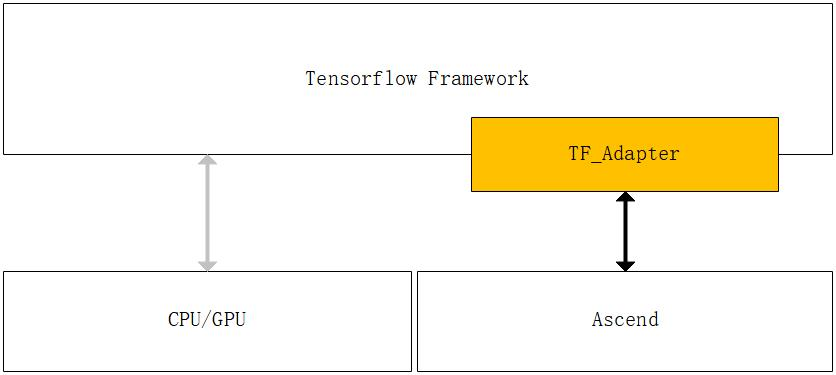

# TF_Adapter

TF_Adapter is committed to providing the outstanding computing power of Shengteng AI processor to developers who use the Tensorflow framework.
Developers only need to install the TF_Adapter plug-in and add a small amount of configuration to the existing Tensorflow script to accelerate their training tasks on the Shengteng AI processor.



You can read [TF_Adapter Interface](https://support.huaweicloud.com/mprtg-A800_9000_9010/atlasprtg_13_0013.html) for more details。
## Installation Guide
### Building from source

You can build the TF_Adapter software package from the source code and install it on the Shengteng AI processor environment.
> The TF_Adapter plug-in has a strict matching relationship with Tensorflow. Before building from source code, you need to ensure that it has been installed correctly [Tensorflow v1.15.0
>版本](https://www.tensorflow.org/install) 。

At the same time, the system meets the following requirements
- GCC >= 7.3.0
- CMake >= 3.14.0
- [SWIG](http://www.swig.org/download.html)

#### Download

```
git clone https://gitee.com/ascend/tensorflow.git
cd tensorflow
```

#### Configure environment
```BASH
./configure
```

By default, executing the above command will pop up the following interactive session window
> Your session may be different.
```BASH
Please specify the location of python with available tensorflow v1.15.0 installed. [Default is /home/jenkins/prj/venv/bin/python]
(You can make this quiet by set env [ASCEND_TARGET_PYTHON_BIN_PATH]):
```

At this point, you are required to enter the path of the python interpreter with Tensorflow v1.15.0 installed. If the default path is correct, press Enter, otherwise, please enter the correct python
Interpreter path.
> You can set ASCEND_TARGET_PYTHON_BIN_PATH Environment variable to suppress the pop-up of the interactive window, but still make sure that the path is valid, otherwise, you will still be asked to enter the correct path to the python interpreter.


After typing, it will take a few seconds to make sure your input is valid, and then the following interactive window will pop up
```
Please specify the location of ascend. [Default is /usr/local/Ascend]
(You can make this quiet by set env [ASCEND_INSTALL_PATH]):
```

At this time, you are required to enter the installation path of the Ascend processor development kit. If the default path is correct, press Enter, otherwise, please enter the correct path to the Ascend processor development kit installation.

> You can set ASCEND_INSTALL_PATH Environment variables to suppress the pop-up of interactive windows, but still make sure that the path is valid, otherwise, you will still be asked to enter the correct installation path of the Ascend processor development kit.


After typing, it will follow the interaction window below
```
Please specify the location of swig. [Default is /usr/local/bin/swig]
(You can make this quiet by set env [SWIG_INSTALL_PATH]):
```
At this time, you are required to enter the path of the SWIG executable file. If the default path is correct, press Enter, otherwise, please enter the correct path of the SWIG executable file.

> You can suppress the interactive window pop-up by setting the SWIG_INSTALL_PATH environment variable, but make sure that the path is valid, otherwise, you will still be asked to enter the correct SWIG executable file path.

After typing, wait for the configuration to complete.
#### Configure cmake

```
mkdir build
cd build
cmake ..
```
#### Build
```BASH
make -j8
```

After compilation, the installation package will be generated in
```
./dist/python/dist/npu_bridge-1.15.0-py3-none-any.whl
```
#### Install

You can install the TF_Adapter plug-in using pip.
```
pip install ./dist/python/dist/npu_bridge-1.15.0-py3-none-any.whl
```

It should be noted that you should ensure that the installation path is the same as the python you specified when compiling
 The interpreter search path is consistent.

## Contributing

Welcome to contribute.

## Release Notes

Release Notes, see our [RELEASE](RELEASE.md).

## License

[Apache License 2.0](LICENSE)
